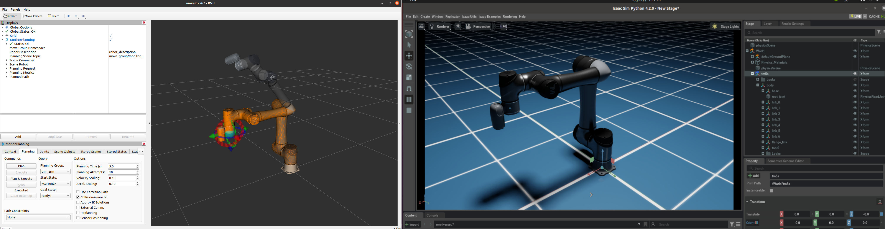

# Overview

This repository provides an example of synchronizing a **TM Robot** with **Isaac Sim**. Users can control the TM Robot externally via **Moveit** using the **TM ROS Driver** and synchronize its pose to Isaac Sim.

## System Requirements

- **TM ROS Driver (Noetic)**
- **Isaac Sim 4.2.0**

### Installing the TM ROS Noetic Driver

Install the driver according to the **TMflow** version of your TM Robot. For example, for **TMflow 2**:

[https://github.com/TechmanRobotInc/tm2_ros1](https://github.com/TechmanRobotInc/tm2_ros1)

- Installation steps:  
  [TM ROS Driver Installation Guide](https://github.com/TechmanRobotInc/tm2_ros1?tab=readme-ov-file#3-tm-ros-driver-usage-and-installation)

- For driver usage and controlling the robot with Moveit, refer to:  
  [TM ROS Driver Usage](https://github.com/TechmanRobotInc/tm2_ros1/blob/noetic/doc/tm_noetic_extension.md#-ros1-driver-usage)

### Installing Nvidia Isaac Sim

1. Install **Isaac Sim 4.2.0** according to Nvidia's official hardware requirements and setup guide:
   - [System Requirements](https://docs.isaacsim.omniverse.nvidia.com/4.2.0/installation/requirements.html)
   - [Installation Guide](https://docs.isaacsim.omniverse.nvidia.com/4.2.0/installation/install_workstation.html)

   If installed via **Omniverse Launcher**, the default **Isaac Sim** path is usually:
   ```bash
   ~/.local/share/ov/pkg/isaac-sim-4.2.0
   ```

2. Navigate to your **Isaac Sim** folder and install `rospkg` in the Python environment:
   ```bash
   cd ~/.local/share/ov/pkg/isaac-sim-4.2.0
   ./python.sh -m pip install rospkg
   ```

## Getting Started

### Real Robot
1. Modify `tmros_setup.sh` to set the correct **TM ROS Driver** path and **Robot IP**.
2. Modify `run_demo.sh` to set your **Isaac Sim** path, then run:
   ```bash
   ./run_demo.sh
   ```

### Virtual Robot
1. Modify `tmros_setup.sh` to set the correct **TM ROS Driver** path.
2. Run `run_demo_virtual.sh` to launch the **virtual robot**:
   ```bash
   ./run_demo_virtual.sh
   ```
Now, you can control the **TM Robot** using **Moveit** and synchronize its pose to **Isaac Sim**.


